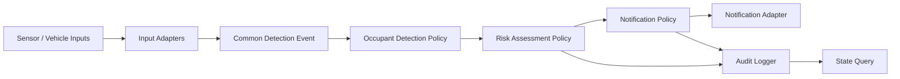

# 개발 계획

## 1. 개발 목표

Python 기반 차량 내 어린이/애완동물 감지 및 알림 시스템을 TDD 방식으로 구현한다. 초기 제품은 실제 카메라 모델이나 차량 CAN 통신 구현보다, 입력 추상화와 안전 판단 정책을 검증 가능한 도메인 로직으로 완성하는 데 집중한다.

## 2. 개발 원칙

- 모든 기능은 요구사항 ID와 연결한다.
- 실패하는 테스트를 먼저 작성하고, 최소 구현으로 통과시킨 뒤 리팩터링한다.
- 외부 센서, 차량 신호, 알림 채널은 어댑터로 분리한다.
- 원본 영상, 음성, 연락처 원문, 위치 세부값은 저장하지 않는다.
- 각 Phase 완료 시 `docs/traceability_matrix.md`의 Forward Trace와 Backward Trace를 갱신한다.

## 3. 권장 아키텍처

## 4. Phase 계획

| Phase | 목표 | 주요 산출물 | 종료 조건 |
| --- | --- | --- | --- |
| Phase 0 | 거버넌스와 추적 기반 확보 | `AGENTS.md`, `requirements.md`, `RELEASE.md`, GitHub Actions, `MEMORY.md`, traceability | 문서와 PR 검증 정책이 존재하고 `git diff --check` 통과 |
| Phase 1 | Python 프로젝트/TDD 기반 구성 | `pyproject.toml`, 패키지 구조, 테스트 구조, 품질 도구 설정 | 완료 |
| Phase 2 | 감지 입력과 공통 모델 구현 | 감지 이벤트 모델, 입력 검증, 설정 모델 | FR-001, FR-012, FR-013 관련 테스트 통과 |
| Phase 3 | 어린이/애완동물 감지 및 위험도 정책 구현 | 감지 정책, 위험도 산정, 알림 단계 결정 | FR-002~FR-007, NFR-001 관련 테스트 통과 |
| Phase 4 | 알림 억제, 어댑터, 감사 로그 구현 | 알림 쿨다운, 가짜 알림 어댑터, 감사 로그, 상태 조회 | FR-008~FR-011, FR-014, NFR-003~NFR-006 관련 테스트 통과 |
| Phase 5 | 통합 시뮬레이션과 릴리즈 준비 | 통합 테스트, 릴리즈 노트 초안, 제한사항 목록 | FR-015, NFR-008~NFR-012 관련 검증 통과 |

## 5. Phase 1 상세 계획

### 목표

프로젝트가 Python 패키지로 빌드 및 테스트될 수 있도록 최소 기반을 만든다.

### 작업

1. `pyproject.toml` 생성
2. `src/occupant_safety/__init__.py` 생성
3. `tests/unit/`, `tests/integration/` 생성
4. `pytest`, `pytest-cov`, `ruff`, `mypy` 설정
5. CI와 동일한 로컬 검증 명령 정리

### 테스트

- `python -m compileall src tests`
- `python -m pytest --cov=src --cov-branch --cov-report=term-missing`
- `ruff check .`
- `ruff format --check .`
- `mypy src`

## 6. Phase 2 상세 계획

### 목표

감지 입력을 공통 데이터 모델로 정규화하고 잘못된 입력을 명시적으로 거부한다.

### 연결 요구사항

- FR-001
- FR-012
- FR-013
- NFR-006
- NFR-007

### 테스트 우선순위

- 정상 감지 이벤트 생성
- 확률 범위 검증
- 필수 필드 누락 검증
- 설정 임계값 검증

## 7. Phase 3 상세 계획

### 목표

어린이/애완동물 감지 정책과 위험도 산정 정책을 결정적으로 구현한다.

### 연결 요구사항

- FR-002
- FR-003
- FR-004
- FR-005
- FR-006
- FR-007
- NFR-001
- NFR-002

### 테스트 우선순위

- 어린이 감지 임계값 경계
- 애완동물 감지 임계값 경계
- 잠금 상태와 온도 조합
- 감지 지속 시간별 알림 단계
- 단일 이벤트 처리 시간 측정

## 8. Phase 4 상세 계획

### 목표

중복 알림 억제, 알림 어댑터 분리, 감사 로그, 현재 상태 조회를 구현한다.

### 연결 요구사항

- FR-008
- FR-009
- FR-010
- FR-011
- FR-014
- NFR-003
- NFR-004
- NFR-005
- NFR-006
- NFR-011

### 테스트 우선순위

- 쿨다운 시간 내 중복 알림 억제
- 수신자 설정 검증
- 알림 어댑터 실패 처리
- 감사 로그 민감 정보 제외
- 마지막 위험 상태 조회

## 9. Phase 5 상세 계획

### 목표

시뮬레이션 기반 통합 흐름을 완성하고 첫 릴리즈 후보를 준비한다.

### 연결 요구사항

- FR-015
- NFR-008
- NFR-009
- NFR-010
- NFR-012

### 테스트 우선순위

- 감지 입력부터 알림 이벤트까지 통합 흐름
- CI 품질 게이트 통과
- 릴리즈 노트 제한사항 기록
- 요구사항, 테스트, 구현, 릴리즈 양방향 추적 완결성 검토

## 10. 브랜치 운영 계획

| 작업 유형 | 브랜치 예시 |
| --- | --- |
| Phase 1 기반 구성 | `feature/phase-1-python-tdd-foundation` |
| 감지 모델 구현 | `feature/phase-2-detection-event-model` |
| 위험도 정책 구현 | `feature/phase-3-risk-policy` |
| 알림/감사 구현 | `feature/phase-4-notification-audit` |
| 릴리즈 준비 | `release/v0.1.0` |

## 11. 완료 기준

- 모든 Must 요구사항에 테스트가 존재한다.
- 모든 테스트가 통과한다.
- 커버리지 기준을 만족한다.
- `docs/traceability_matrix.md`에서 미추적 요구사항이 없다.
- `RELEASE.md` 기준의 릴리즈 체크리스트가 완료된다.
